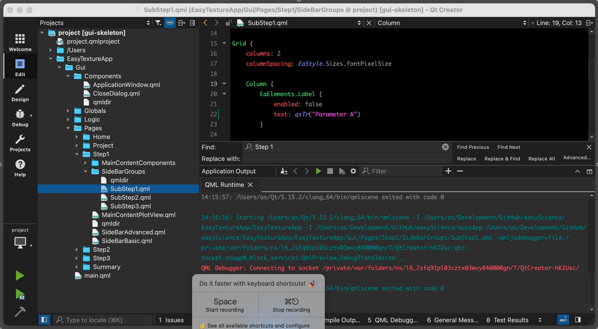

# TODO

Let's divide the development process into several steps.

## Define the workflow

- [ ] Create a `Jupyter Notebook` with a simple example of complete data processing. Ideally, this `Notebook` should:
	- [ ] Have only those dependencies available through [PyPI](https://pypi.org/).
	- [ ] Use [Bokeh](https://bokeh.org/) as a plotting library.
	- [ ] Be divided into several chapters, each corresponding to one step in the data processing workflow. An example from the diffraction data analysis workflow:
		- Project definition.
		- Sample description (Main step 1).
		- Experiment description (Main step 2).
		- Analysis step (Main step 3).
		- Summary report.
	- [ ] Each chapter should contain one to three basic visualization widgets, e.g., raw 3d plots from the detector, reduced 1d diffraction pattern, etc.
	- [ ] Each chapter should have controls for the main visualization widgets, e.g. text edit boxes and comboboxes with configuration parameters, buttons to start the reduction process, read-only fields with some important metadata, etc. These controls should be divided into named groups indicating whether they are intended for the general (basic controls) or advanced (advanced controls) user.
	
## Prototyping the graphical user interface

- [x] Create a skeleton of the GUI application. No Python backend is required at this stage. All development is done in `Qt QML` based on the generic technic-independent [EasyApp](https://github.com/EasyScience/easyApp) from the [EasyScience](https://github.com/EasyScience) framework.
- [ ] Add all technique-specific GUI elements based on the `Jupyter Notebook` from the previous chapter.

### How to run and edit the GUI prototype.

* Create and go to `EasyScience` directory
  ```
  mkdir EasyScience && cd EasyScience
  ```
* Download [EasyApp](https://github.com/EasyScience/easyApp) from GitHub.
* Download [EasyTextureApp](https://github.com/EasyScience/EasyTextureApp) from GitHub.
* Install `Qt 5.15.2` (select the `Qt WebEngine' module, disabled by default).
* Open the `Qt Creator` application.
* From `Qt Creator` open the project file `project.qmlproject` in the `EasyTextureApp` directory.
* Click the green `Run` button at the bottom of the left sidebar of the `Qt Creator`.

### How to edit GUI elements in live mode.

* Open `project.qmlproject` via `Qt Creator` and select the `.qml` file to edit.
* Click the `Design` button at the top of the left sidebar of `Qt Creator`. _Note: If this button is disabled, find and click `About plugins...` in the `Qt Creator` menu, scroll down to the `Qt Quick` section and enable `QmlDesigner`._
* In the `Design` window, click the small `Show Live Preview` button in the top panel of the application. _Note: Showing the entire `main.qml` application window in live mode works best when the open `main.qml` is moved to another monitor and does not overlap with `Qt Creator`.



## Binding to the Python backend

To be added later.